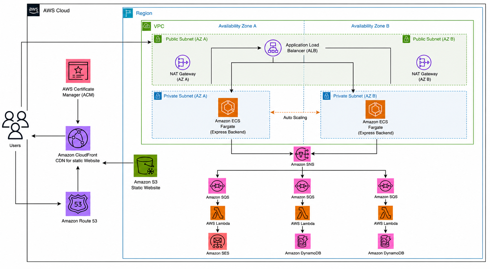

# Rice Mill Backend

Containerized Express.js REST API for the Rice Mill Management Platform, deployed on Amazon ECS Fargate behind an Application Load Balancer.

This repo contains the backend service only. Infrastructure (VPC, ALB, ECS cluster, ECR, DynamoDB, Cognito, SNS/SQS) is provisioned separately via AWS CDK. See the [infra repo / frontend repo] for the rest of the project.

---

# Architecture


- **Express.js** - REST API for order management and application workflows
- **Docker** - Backend service is containerized for deployment
- **Amazon ECS Fargate** - Runs the container in the private subnet of a 3-tier VPC
- **Application Load Balancer (ALB)** - Public entry point, routes traffic to the Fargate service
- **Amazon ECR** - Stores versioned Docker images
- **Amazon Cognito** - Validates authenticated requests
- **Amazon DynamoDB** - Reads and writes application data
- **Amazon SNS** - Backend publishes order events directly to SNS for downstream processing (inventory, analytics, notifications via SQS/Lambda)

---

# Prerequisites

- Node.js 22
- Docker (for local builds and running the container)
- AWS CLI, configured with credentials that have ECR/ECS access

```bash
node -v
npm -v
docker --version
aws --version
```

---

# Local Development

## 1. Install dependencies

```bash
npm install
```

## 2. Run locally

```bash
npm start
```

## 3. Run in Docker (matches production runtime)

```bash
docker build -t backend:local .
docker run -p 3000:3000 backend:local
```

---

# Environment Configuration

The service expects the following environment variables at runtime (set via the ECS task definition, not committed to the repo):

```
USER_TABLE:db_user.tableName,
PRODUCTS_TABLE:db_products.tableName,
CART_TABLE:db_getcartcount.tableName,
ORDER_TABLE:db_putorders.tableName,
ANALYTICS_TABLE:db_analytics.tableName,
INVENTORY_TABLE:db_product_inventory.tableName,
SNS_TOPIC_ARN: sns_putorder.topicArn

```

---

# Deployment

Deployment is fully automated through GitHub Actions — there is no manual deploy step. Every push to `main` triggers the pipeline below.

## How image updates reach the running service

ECS does not hot-swap a running container's image — a new **task definition revision** has to be registered with the updated image tag, and the service has to be told to roll out that revision. The pipeline handles this in two steps:

1. `task-definition.json` contains a placeholder, `IMAGE_TAG`, in place of a real image tag. The pipeline replaces it with the current commit SHA (`sed -i "s|IMAGE_TAG|${{ github.sha }}|g" task-definition.json`) right before deploying.
2. The `amazon-ecs-deploy-task-definition` action registers this updated file as a new task definition revision, then updates `Ricemill_ECS_service` to use it. With `wait-for-service-stability: true`, the job doesn't finish until ECS confirms the new tasks are healthy and old tasks have been drained — so a failed rollout shows up as a failed GitHub Actions run, not a silent broken deploy.

## CI/CD Pipeline

Workflow file: `.github/workflows/deploy.yml`

1. Checks out the repository
2. Authenticates to AWS via OIDC (no long-lived credentials stored in GitHub)
3. Logs in to Amazon ECR
4. Builds the Docker image, tagged with the commit SHA
5. Tags the image for ECR
6. Pushes the image to ECR
7. Injects the new image tag into `task-definition.json`
8. Registers a new task definition revision and updates the ECS service, waiting for the rollout to stabilize

---

# Infrastructure Deployment Flow

```
GitHub Push
      |
      v
GitHub Actions
      |
      v
OIDC Authentication  →  AWS IAM Role
      |
      v
Docker Build (tagged with commit SHA)
      |
      v
Push to Amazon ECR
      |
      v
Update task-definition.json with new image tag
      |
      v
Register new ECS task definition revision
      |
      v
Update ECS service → roll out new tasks → wait for stability
```

---

# Task Definition

`task-definition.json` defines the container spec (image, CPU/memory, port mappings, environment variables, IAM execution role) used to launch tasks on Fargate. The `IMAGE_TAG` placeholder is the only field the pipeline modifies automatically — everything else (CPU/memory sizing, env vars, roles) is edited manually and committed.

---

# IAM & Security Notes

- The pipeline assumes an IAM role (`IAM_GITHUB_CONTAINRIZED_BACKEND`) via GitHub OIDC — no static AWS access keys are stored as GitHub secrets.
- Consider referencing the AWS account ID and role ARN via a GitHub Actions repository variable rather than hardcoding them in the workflow file, particularly if this repo is public.

---

# Useful Commands

## Run tests

```bash
npm run test
```

## Build Docker image locally

```bash
docker build -t backend:local .
```

## Manually register a task definition revision (for debugging)

```bash
aws ecs register-task-definition --cli-input-json file://task-definition.json
```

---

# Technologies Used

- Node.js
- Express.js
- Docker
- Amazon ECS (Fargate)
- Amazon ECR
- Amazon DynamoDB
- Amazon Cognito
- Amazon SNS
- GitHub Actions
- GitHub OIDC